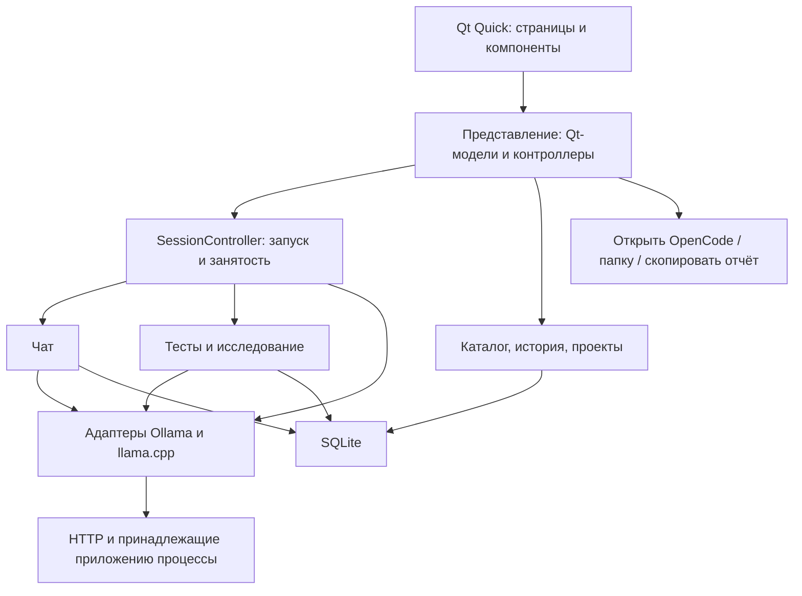

# Модельная студия — архитектура

Дата: 24 сентября 2026. Архитектурные решения и план перехода; приложение уже реализовано.

Основание: [концепция v2](design-v2/CONCEPT.md), [десять макетов](design-v2/README.md), текущий код LLM Meter и принципы навыка `audit-project`.

Документ сохраняет исходные архитектурные решения и план перехода. Текущая карта файлов приведена в §11; фактический объём, отклонения от плана и границы проверки — в [IMPLEMENTATION.md](IMPLEMENTATION.md). Для работы с кодом начинайте с [AGENTS.md](../AGENTS.md). Упоминания будущих слоёв в проектных разделах не означают, что их нужно создавать заранее.

## 1. Основное решение

**Одно desktop-приложение: Python + PySide6 / Qt Quick + SQLite. Одна управляемая сессия модели, несколько способов её использования.**

Qt Quick отвечает за интерфейс. Python — за модели, серверы, чат, измерения и исследования. SQLite — за локальные данные. Ollama и llama-server остаются отдельными существующими программами.

Архитектура — модульный монолит: понятные части внутри одного процесса, обычные вызовы между ними, явное владение ресурсами. HTTP нужен только для общения с модельными серверами.

Почему такой выбор:

| Решение | Причина для этого проекта |
|---|---|
| Python | Уже есть работающие клиенты, отмена запросов, измерения, проверки файлов и процессов; их можно переносить постепенно |
| Qt Quick / QML | Подходит для собственных визуальных компонентов, состояний и анимации; Python официально интегрируется через PySide6 |
| SQLite | Локальная история, поиск, связанные записи и атомарное сохранение без отдельного сервера БД |
| Один управляющий процесс | Один владелец сессии, одна политика отмены и закрытия, меньше источников рассинхронизации |

Qt предоставляет интеграцию Python/QML и нативный выбор папки Windows: [Qt Quick](https://doc.qt.io/qtforpython-6/PySide6/QtQuick/), [FolderDialog](https://doc.qt.io/qt-6/qml-qtquick-dialogs-folderdialog.html). Пригодность конкретной сборки для наших макетов подтверждается первым вертикальным прототипом.

Сравнение альтернатив: Tkinter сохраняет простую поставку, но потребует большой ручной работы для согласованного визуального языка. Tauri с React потребует ещё Rust и границу обмена с Python либо переноса ядра. Electron добавляет браузерный runtime. Для существующего Python-проекта Qt — наиболее прямой путь; цена решения — QML, Qt-зависимости и отдельная проверка упаковки.

## 2. Правила, которые держат продукт целым

1. Выбор модели в списке не запускает и не останавливает сервер.
2. Настройки редактируются отдельно от снимка действующей сессии.
3. Запуск сервера, открытие чата и открытие OpenCode — отдельные команды.
4. Все страницы показывают одну фактическую сессию.
5. Сохранённая скорость, текущая телеметрия и оценка памяти имеют разные подписи и происхождение.
6. Результат относится к конкретному артефакту, эффективным настройкам, окружению и методике.
7. Неизвестное значение остаётся неизвестным. Отсутствие метрики не превращается в ноль.
8. Удаление весов сохраняет историю. Очистка истории — отдельное действие.
9. Приложение управляет только принадлежащими ему процессами; подключение к серверу не даёт права его завершать.
10. Чат, тест и исследование используют один способ обращения к runtime и одну политику отмены.
11. Завершённые измерения сохраняются сразу; отмена исследования не уничтожает их.
12. Названия моделей и декоративные изображения не определяют поведение приложения.

## 3. Карта частей и зависимостей



Стрелки показывают направление вызовов. Состояние возвращается неизменяемыми снимками и типизированными событиями. Точка входа `bootstrap.py` создаёт Store, Qt и мост Studio; Studio связывает каталог, сессию, чат и Workers. Сервисы получают свои зависимости явно.

- QML знает доступные действия и данные отображения. Не читает БД, не запускает процессы и не вычисляет рейтинги моделей.
- Представление знает Qt и сценарии приложения. Не разбирает ответы Ollama и не строит командную строку llama-server.
- Сценарии знают предметные типы, интерфейс backend и конкретные операции хранения. Не импортируют Qt.
- Адаптеры знают протоколы и процессы. Не знают страницы, кнопки и рекомендации.
- Хранилище знает SQL и форматы записей. Не решает, какую модель запускать.

Небольшие `Protocol` нужны на границе backend и для подмены внешних эффектов в тестах. Для каждой функции отдельный интерфейс не создаётся. Внутренние сервисы можно передавать напрямую.

## 4. Сущности: что именно мы храним и показываем

| Сущность | Смысл и срок жизни |
|---|---|
| Модель / артефакт | Конкретные веса и квантование, постоянный внутренний ID; алиас — только отображаемое имя |
| Установка | Где доступен артефакт: файл/набор файлов или модель в конкретном Ollama; может исчезнуть |
| Профиль возможностей | Сведения о модели с источниками и ограничениями; не копируется при смене контекста |
| Runtime | Зарегистрированная сборка/подключение, версия, тип управления, поддерживаемые параметры |
| Черновик запуска | Выбранная модель и желаемые настройки; его можно менять при работающем сервере |
| Снимок сессии | Фактически запущенная модель, адрес, эффективные параметры, ID сессии и статус |
| Результат теста | Неизменяемая запись: что запрашивали, что применилось, как измеряли, что получили |
| Исследование | Ограниченный план, завершённые шаги и причина завершения/остановки |
| Рекомендация | Вычисленный выбор из подходящих результатов с объяснением и ссылками на доказательства |
| Диалог / сообщение | Локальная история; каждое сообщение модели связано со своим снимком настроек |
| Проект | Выбранная пользователем папка для открытия OpenCode, имя и время последнего использования |

### Идентичность модели

Путь, имя файла и тег Ollama недостаточны для совпадения результатов. Разные кванты — разные артефакты. Один артефакт может иметь несколько установок и алиасов.

Для GGUF сохраняем быстрый отпечаток файла для обнаружения изменений и проверяемый digest содержимого для устойчивой идентичности. Digest вычисляется в фоне один раз при добавлении или изменении, с отменой и без блокирования обычного запуска. Для составного артефакта нужен манифест всех необходимых частей. Неполный набор не считается готовой установкой. Фоновое хеширование приостанавливается на время замеров.

Пока идентичность не подтверждена, можно работать, но нельзя автоматически приписать модели тесты другого пути. Для Ollama используем доступный digest и идентичность подключения; его семантику не приравниваем автоматически к хешу GGUF. Объединение записей допустимо только при доказанном совпадении. Удалённая установка помечается отсутствующей, а артефакт и результаты остаются.

### Возможности и настройки

Возможности получаются из метаданных модели, сведений runtime и проверок. Для каждого утверждения нужны область применимости, источник и состояние: поддерживается / не поддерживается / неизвестно; успешная проверка дополнительно фиксирует условия подтверждения. Например, наличие MTP в модели ещё не доказывает его работу в выбранной сборке.

Настройки разделяются по смыслу:

- **Сервер:** контекст, offload, KV, параллельность, поддерживаемые параметры MTP/Draft.
- **Запрос:** лимит ответа, sampling, reasoning и другие параметры, если этот runtime применяет их к запросу.
- **Методика:** входные данные, повторы, прогрев, правила подсчёта.

Адаптер объявляет, какие изменения требуют перезапуска. Общий конфиг не навязывает одинаковую реализацию всем backend. `Auto` сохраняется как пожелание, а в результате отдельно записывается установленное/наблюдаемое значение. Неизвестное эффективное значение снижает доказательность совпадения.

Для специальных сборок сохраняем дополнительные аргументы runtime как список. Проверка запрещает переопределять ими уже управляемые параметры, адрес и путь модели; эффективный список входит в снимок запуска и ключ сопоставимости. Версия сборки дополняется идентичностью исполняемого файла, если он доступен локально: одинаковая строка версии не доказывает одинаковую сборку.

## 5. Сессия: единственный владелец запуска

`SessionController` принимает команды запуска, выгрузки, генерации, теста и исследования. Это небольшой координатор: он проверяет допустимость действия, передаёт работу специализированному модулю и публикует состояние. Сканирование, SQL, алгоритм рекомендаций и формат отчёта в него не входят.

Состояние сервера: `stopped → starting → ready → stopping → stopped`. Ошибка запуска или падение переводит сессию в `failed` с причиной и результатом очистки ресурсов. Потерянное внешнее подключение — `disconnected`, а не «модель выгружена».

Занятость — отдельное поле: `idle / chat / benchmark / research`. Это не десятки сочетаний перечисления серверных статусов.

| Команда | Поведение |
|---|---|
| Запустить | Проверить установку и конфигурацию → запустить/подключить → проверить готовность и фактические параметры → опубликовать `ready` |
| Применить изменённые серверные параметры | Показать необходимость перезапуска; до команды применения действующая сессия сохраняется |
| Остановить ответ | Отменить конкретный запрос, сохранить частичный ответ; сервер остаётся доступным после подтверждённого завершения запроса |
| Выгрузить | Остановить текущую работу с явным подтверждением при занятости, затем освободить модель своим допустимым способом |
| Быстрый тест | Использовать совместимую действующую сессию; иначе явно предложить запуск/перезапуск |
| Исследовать | Получить исключительное право на операции приложения, выполнить ограниченный план, освободить право в `finally` |

После согласованного перезапуска старый сервер уже может быть остановлен, а новый — не запуститься. Интерфейс честно показывает это и предлагает вернуть предыдущую конфигурацию; атомарный бесшовный переход не обещается.

Каждая операция получает ID, каждая новая сессия — собственное поколение. Поздний ответ старого запроса не может поменять статус новой сессии или другую беседу. Сохранение исторического результата при этом привязано к исходному ID.

**Граница внешних клиентов:** внутренняя блокировка не запрещает OpenCode или другой программе отправлять запросы напрямую. Если backend умеет сообщать занятость, проверяем её. Если нет — показываем «Внешняя активность неизвестна». Перед исследованием пользователь видит необходимость завершить внешнюю работу; обнаруженная конкуренция помечает замеры как несопоставимые. Не обещаем технически гарантированную изоляцию и не добавляем ради неё обязательный прокси.

### Владение процессами

- Запущенный нами llama-server принадлежит сессии; занятый чужим процессом порт не даёт права завершить этот процесс.
- Ollama обычно является внешней службой. «Выгрузить модель» использует API выгрузки выбранной модели; служба продолжает работать.
- Для внешнего llama.cpp допустимо отключение; выгрузка доступна только при наличии подтверждённого API. Подпись кнопки соответствует действию.
- Закрытие приложения по умолчанию отменяет его работу и завершает принадлежащий ему сервер. При активной работе или открытом OpenCode показывается последствие закрытия. Внешние процессы не завершаются.
- На Windows принадлежащий нам сервер помещается в Job Object с политикой завершения при закрытии владельца; создание и привязка должны исключать окно для оставшегося без владельца процесса. Это маленький платформенный модуль, проверяемый интеграционно. [Документация Microsoft](https://learn.microsoft.com/en-us/windows/win32/procthread/job-objects).
- После аварии записи незавершённых операций становятся `interrupted`. Старый PID из БД не является основанием для завершения процесса.

Удаление используемой установки сначала требует завершения принадлежащей приложению сессии. Непосредственно перед удалением повторно проверяются выбранный путь, область разрешённых папок, отпечаток и доступные сведения о внешнем использовании. Неопределённость показывается пользователю; остановка чужого процесса не является способом обойти её. Для Ollama операция касается выбранного тега и правил самого backend о разделяемых слоях.

## 6. Выполнение без зависания интерфейса

Три понятных места выполнения:

1. **Главный поток Qt:** ввод, отрисовка, Qt-модели, доставка команд. Никаких ожиданий HTTP, процессов, сканирования, хеширования или запросов истории к БД.
2. **Один поток сессии:** последовательное исполнение запуска, генерации, теста или исследования. Исследование само вызывает этапы; вложенные команды не ставятся в очередь с ожиданием самих себя.
3. **Небольшой ограниченный пул фонового I/O:** каталог, загрузка истории, экспорт и телеметрия. Его задачи не меняют сессию напрямую; возвращают результаты с ID/ревизией.

Qt-сигналы доставляют результаты в главный поток. Объекты QML и модели списков меняются только там. Ядро получает обычный callback событий и токен отмены, поэтому тестируется без окна.

Отмена проходит вне очереди длинных заданий: выставляет `threading.Event` и прерывает транспорт текущего запроса безопасным неблокирующим способом. Очистка и ожидание завершения выполняются работником. Если закрытие соединения не остановило вычисление на сервере, сессия не становится `idle` до проверки; для своего сервера возможен явный перезапуск, для чужого — сообщение об ограничении.

Текст ответа доставляется порциями, а не отдельным сигналом на каждый токен. Телеметрия опрашивается с ограниченной частотой и таймаутом; следующий опрос не начинается, пока не закончился предыдущий. Очередь объединяет устаревшие снимки телеметрии, но сохраняет порядок текста, ошибок и завершения операций. Анимация не зависит от частоты измерений.

## 7. Backend и метрики

Общий контракт содержит только нужные операции: обнаружить модели, получить возможности, подготовить/проверить сессию, отправить потоковый текстовый запрос, отменить его, получить доступное состояние. Управление процессом — отдельная способность, а не обязательный метод для любого HTTP-подключения.

Адаптеры Ollama и llama.cpp используют общий транспорт, но не наследуют друг от друга. Различия payload, SSE/JSON, единиц времени, контекста и MTP остаются внутри соответствующего адаптера.

Поток возвращает события текста, отдельно доступного reasoning, итоговых usage/timings и завершения/ошибки. Чат и тесты используют этот контракт. Отсутствующие timings допустимы для обычного чата, но не дают права объявить точную скорость benchmark.

У измерения есть значение, единица, источник, область измерения и время. Для отсутствующих данных хранится причина; для приблизительных — признак оценки.

| Показатель | Как интерпретируем |
|---|---|
| Скорость генерации | Токены и время генерации, предоставленные runtime, с указанием состава учитываемых токенов |
| Скорость обработки входа | Отдельные входные токены и время; не смешивается с генерацией |
| TTFT | Клиентское время до первого содержательного события, с определением учёта reasoning |
| VRAM устройства | Общая занятость GPU, может включать другие приложения |
| RAM системы / процесса | Разные поля и подписи; системная RAM не называется памятью модели |
| Буферы весов и KV | Только при наличии источника, с его ограничениями |
| Offload | Слои на GPU или показатель размещения backend; не загрузка GPU |
| MTP | Фактические счётчики принятия draft при доступности; включённый флаг сам по себе не подтверждает ускорение |

Для удалённого backend не подставляем показатели локального компьютера. Внешнюю генерацию OpenCode измеряем только при наличии доступных метрик backend. Прогноз памяти до запуска — отдельная оценка; при отсутствии надёжной оценки показываем сохранённый замер или отсутствие данных.

## 8. Тесты, исследование и рекомендации

### Один измерительный путь

Быстрый тест и исследование используют один `BenchmarkRunner`. Он получает неизменяемые конфигурацию и методику, выполняет прогрев и прогоны, собирает источники метрик, валидирует результат и сохраняет его. Исследование лишь выбирает последовательность конфигураций.

Методика имеет версию: вход/его воспроизводимый рецепт и digest, параметры генерации, прогрев, повторы, правила cache, сбор метрик и критерии успешности. Для сравнения скорости используется одинаковая нагрузка. Проверка длинного контекста — отдельный тип нагрузки; её скорость не смешивается с коротким тестом.

Завершение без достаточного вывода, обрыв потока, несовпадение контекста, OOM, отмена, недоступность timings и конкурирующая нагрузка сохраняются с различными статусами. Неудача не становится нулём токенов в секунду. История хранит компактные данные каждого прогона и агрегаты; полные ответы скоростных тестов не сохраняются по умолчанию.

### Ограниченное исследование

План до старта показывает модель, окружение, ограничения контекста, бюджет времени/числа конфигураций и поведение по завершении. Уже проверенные точные сочетания можно использовать повторно с указанием даты.

Последовательность: базовый запуск → доступные варианты ускорения → кандидаты контекста → при необходимости варианты KV → повторная проверка финалистов. После ошибки выбирается только следующий обоснованный кандидат. Не предполагаем строгую монотонность скорости или расхода памяти во всех сборках и режимах.

Максимальный контекст требует длинного входа, места для ответа и проверки фактического принятого контекста без скрытого усечения. Короткий тест и успешное выделение памяти этого не доказывают. Если backend не позволяет проверить условие, рекомендация получает соответствующее ограничение.

Каждый завершённый шаг фиксируется транзакцией вместе с продвижением задания. После отмены/сбоя можно предложить продолжение с проверкой окружения; автоматически повторять работу после открытия приложения нельзя. Незавершённый прогон запускается заново, его частичные числа не объединяются с новым.

По умолчанию после исследования восстанавливаем существовавшую до него конфигурацию; если исходно сервер был остановлен — останавливаем исследовательскую сессию. Это видно в плане. Отмена останавливает подбор, а восстановление показано отдельным этапом; его тоже можно отменить с остановкой своего сервера. Ошибка восстановления отображается отдельно и не удаляет замеры.

### Правила рекомендаций

Рекомендации вычисляются чистой функцией по подходящим сохранённым результатам. Отдельный движок правил и постоянно синхронизируемая таблица рейтингов пока не нужны.

- **Максимальная скорость:** лучший подтверждённый результат среди сопоставимых проверенных конфигураций; повторные прогоны и разброс видны.
- **Максимальный контекст:** наибольший размер, прошедший длинную проверку в границах исследования.
- **Сбалансированный:** кандидат, удовлетворяющий выбранной цели по контексту и ограничению памяти, с приемлемым относительно лучшего результата падением скорости. Стартовая гипотеза допустимого падения — 20%; её проверяем на реальных данных, сохраняем как версию политики и показываем в объяснении. Цель контекста задаётся в плане, не угадывается по имени модели.

Если условий недостаточно или несколько режимов приводят к одной конфигурации, интерфейс честно показывает это. Не создаём искусственно три разных результата. KV-квантование не объявляется улучшением качества: рекомендации оценивают измеренную производительность и заданные ограничения.

Ключ сопоставимости: подтверждённый артефакт + эффективные серверные и запросные настройки + сборка/runtime + оборудование/драйвер + методика/нагрузка. Все входные снимки сохраняются вместе с записью, ключ имеет версию. Неизвестные существенные поля исключают строгую рекомендацию. Изменение окружения помечает прошлые рекомендации требующими проверки, сохраняя историю.

До запуска точное совпадение с желаемыми настройками показывается как историческое свидетельство, а не гарантия будущего значения `Auto`. После запуска совпадение уточняется по эффективным параметрам. Близкие конфигурации подписываются отдельно с различиями.

## 9. Встроенный чат и OpenCode

### Чат

Чат использует общую сессию; проектная папка ему не требуется. Перед отправкой фиксируются модель, конфигурация и выбранная история. Переключение страницы не отменяет ответ.

Сообщение пользователя сохраняется до запроса. Ответ имеет статусы `streaming / complete / cancelled / error / interrupted`; текст буферизуется и периодически сохраняется короткими транзакциями, например раз в секунду, затем обязательно при завершении. При аварии возможна потеря последнего несохранённого фрагмента, а не всей беседы. Ошибка записи явно показывается; приложение не заявляет, что ответ сохранён.

Reasoning отображается свёрнутым только при наличии отдельного соответствующего поля runtime. Не реконструируем скрытые рассуждения из обычного текста. Каждое сообщение хранит происхождение модели, поэтому продолжение диалога другой моделью не переписывает историю.

Перед запросом проверяется доступная оценка размера истории с резервом ответа. При отсутствии точного tokenizer счётчик помечается приблизительным. Переполнение требует явного сокращения/нового диалога; молчаливое усечение и автоматическое сжатие не входят в первую версию. Markdown — ограниченное отображение без выполнения HTML/команд; инструменты агента, файлы и vision остаются за границей первой версии.

### OpenCode и проекты

Системный выбор папки → сохранение проекта → проверка готовности сервера → отдельная команда открытия OpenCode в этой папке с выбранным подключением.

Интеграция находится в одном адаптере. До реализации проверяем установленную версию OpenCode, официально поддерживаемые аргументы/настройки provider, передачу модели и запуск в каталоге. Строим вызов из проверенных аргументов, без склейки пользовательского пути с shell-командой. Если Windows launcher требует `.cmd`, используем проверенный способ вызова с отдельными тестами кавычек и Unicode.

Файлы подключения, если они необходимы, создаются в управляемом каталоге приложения. Проектный конфиг пользователя не перезаписывается. Неуспешный запуск OpenCode не останавливает уже готовую модель. Закрытие OpenCode не означает выгрузку сервера; прекращение серверной сессии делает его подключение недоступным.

## 10. Хранение и пути

Постоянные данные находятся в системном локальном каталоге приложения, например `%LOCALAPPDATA%/ModelStudio/`, который получается через системный API. Путь исходного репозитория и текущая рабочая директория не участвуют в поиске пользовательских данных.

```text
ModelStudio/
  studio.db       модели, результаты, диалоги, проекты и настройки
  reports/        явные экспорты пользователя
  logs/           ограниченные по размеру диагностические логи
  cache/          восстанавливаемые данные и временные подключения
  backups/        резервные копии перед миграциями / по запросу
```

Модельные файлы и установленные runtime остаются в выбранных пользователем местах. Переименование папки приложения не ломает БД и внутренние ресурсы. Если переместили внешний runtime или модель, предлагаем выбрать новый путь; не сканируем весь диск и не угадываем совпадение по названию.

### Минимальная схема

| Таблица | Содержимое |
|---|---|
| `models` | UUID, идентичность артефакта, алиас, версия и сведения профиля возможностей |
| `installations` | Ссылки на модель, путь/тег и подключение, отпечаток, наличие |
| `runtimes` | Тип, расположение/endpoint, версия, проверенные возможности и предпочтения |
| `benchmark_results` | Модель, исследование при наличии, снимки конфигурации/окружения/методики, компактные прогоны, агрегаты, статус |
| `research_jobs` | План, исходная сессия, прогресс, завершённые шаги и причина остановки |
| `conversations` | Название, даты и настройки диалога |
| `messages` | Диалог, порядок, роль, текст/reasoning, статус, происхождение и usage |
| `projects` | Канонический путь, имя и последнее использование |
| `settings` | Небольшое число версионированных настроек интерфейса и приложения |
| `imports` | Источник и digest импортированного старого документа, результат импорта |

Снимки с редкими меняющимися полями хранятся как версионированный JSON внутри записи. Поля фильтрации и сопоставимости — обычные индексируемые столбцы. Не создаём отдельную таблицу для каждого переключателя и не превращаем всю БД в универсальный набор ключей/значений.

Внешние ключи включены. Удаление установки не каскадирует на `models`, тесты и сообщения. Исторические снимки самостоятельны: исчезновение runtime не уничтожает сведения о тесте. Очистка истории и удаление диалога — отдельные ограниченные транзакции. Файловое удаление не атомарно с SQL: после успеха файл помечается отсутствующим; если запись не удалась, следующий скан восстанавливает факт отсутствия без удаления истории.

Используем стандартный `sqlite3`, явный SQL, короткие транзакции и нумерованные миграции. У каждого фонового исполнителя своё соединение; соединения не передаются между потоками. WAL позволяет читать историю во время записи, но писатель одновременно только один; нужны `busy_timeout` и ограниченный повтор при блокировке. Сетевое ожидание и генерация никогда не находятся внутри транзакции. [SQLite WAL](https://www.sqlite.org/wal.html).

Для поставки фиксируем SQLite с исправлением WAL-reset: 3.51.3+ либо официальную исправленную ветку; проверяется фактическая `sqlite3.sqlite_version` в собранном приложении. Старую SQLite из произвольного системного Python не считаем автоматически пригодной. Основание: [SQLite, раздел WAL-reset bug](https://www.sqlite.org/wal.html).

Сохранение считается успешным только после commit. Резервная копия работающей БД создаётся Backup API, а не копированием одного `.db` при активном WAL. Восстановление выполняется при остановленных операциях и закрытых соединениях, с проверкой схемы и сохранением предыдущего файла. [SQLite Backup API](https://www.sqlite.org/backup.html).

Один экземпляр приложения на каталог данных защищается системной блокировкой Qt. Второй запуск сообщает о уже открытом экземпляре. Отдельная служба IPC для этого не нужна.

### Отчёты и диагностика

Один форматировщик создаёт текст для буфера обмена и текстового экспорта; JSON-экспорт имеет версию схемы. В отчёте есть методика, настройки, окружение, замеры и ограничения. Полные личные пути и тексты диалогов по умолчанию не включаются. Автоматической отправки в ChatGPT нет.

«Открыть папку отчётов» открывает `reports/`. Сохранённая история доступна в приложении независимо от наличия экспортов. Системные логи ротируются; повседневная телеметрия не записывается в БД бесконечно. Для benchmark сохраняются агрегаты и, при необходимости, ограниченная выборка.

## 11. Структура проекта

Текущая карта. Пути соответствуют реализации, а не первоначальному каркасу:

```text
src/model_studio/
  bootstrap.py           вход, Store, Studio, QML-движок, захват окна
  domain.py              статусы, StreamChunk, ошибки сессии
  configuration.py       LaunchConfig, валидация, идентичность mmproj
  catalog.py             обнаружение, идентичность, безопасное удаление
  session.py             жизненный цикл и исключительная занятость
  chat.py                потоковый диалог и сохранение сообщений
  attachments.py         управляемые PNG/JPEG и переносимые ссылки
  benchmarks/
    research.py          план, запуск шагов, evidence, продолжение
    recommendations.py   выбор проверенных режимов
    reports.py           текст/JSON результата
  backends/
    contract.py          протокол клиента
    ollama.py            адаптер Ollama и изображения
    llama_cpp.py         адаптер llama.cpp и изображения
    images.py            контракт base64 и MIME
    process.py           собственный llama-server
  platform/
    paths.py             каталоги локальных данных
    windows_process.py   Windows Job Object и дерево процесса
  storage/
    store.py             SQLite, миграции, запросы, backup, импорт
  integrations/
    opencode.py          отдельное подключение и запуск клиента
  desktop/
    controllers.py       Qt-мост, команды страниц, отображаемые данные
    workers.py           последовательная сессия, I/O-пул, очередь
    preview.py           только демонстрационные данные для QA
    qml/                 Main, Theme, пять *Page.qml, общие компоненты
      icons/             SVG и лицензия сторонних иконок
engine.py                общий HTTP/измерительный runner и телеметрия
llama_cpp.py             общий низкоуровневый клиент llama.cpp
inventory.py             обнаружение файлов и безопасные операции
runtime_profiles.py      профили запуска по полному пути модели
model_aliases.py          отображаемые имена
managed_server.py        общий помощник legacy-сервера
app.py, models_tab.py     прежний Tkinter UI
Студия.pyw               запуск нового UI из перемещаемого checkout
Запустить.pyw/.cmd        пользовательские точки входа в студию
launch.pyw               запуск только прежнего Tkinter UI
tests/                   unittest, временные БД и поддельные backend
packaging/, tools/       упаковка EXE и служебные сценарии
docs/                    решения, состояние реализации, макеты и QA
benchmarks/              опубликованные отчёты, не код runner
AGENTS.md                маршруты изменения и команды проверки
```

Миграции находятся в `Store._migrate`. QML-страницы и компоненты лежат прямо
в `desktop/qml/`; каталоги `pages/` и `components/` пока не нужны. Единый runner
остаётся в корневом `engine.py`; второй `benchmarks/runner.py` не создавался.

Если `controllers.py` или `domain.py` начинают объединять несвязанные изменения, их делим по функциям. Заранее вводить пакет на каждый класс не нужно. Каталоги `utils`, `common`, `managers` без определённой ответственности не создаём.

## 12. Связь с десятью макетами

Десять макетов становятся пятью разделами и состояниями внутри них, поэтому одна и та же логика не реализуется десять раз.

| Макеты | Реализация поведения |
|---|---|
| 01 Запуск, 02 Активная модель, 03 Ручные настройки | Одна страница запуска, общий черновик и отдельный снимок сессии |
| 04 Чат | История бесед и общий потоковый клиент через сессию |
| 05 Модели | Каталог установок и архив; профиль модели не зависит от выбранного режима |
| 06 Быстрый тест | Текущая конфигурация и `BenchmarkRunner` |
| 07 План, 08 Прогресс | Одно задание исследования с сохранённым состоянием |
| 09 Результаты | Запросы истории, вычисленные рекомендации и общий экспорт |
| 10 Настройки | Runtime, папки, подключения, данные и резервная копия |

Общие компоненты: выпадающий список с поиском, выбор контекста, карточка метрики с источником, состояние модели, предупреждение о неподтверждённой конфигурации, строка сессии. У карточек нет собственного клиента runtime или копии глобального состояния.

Цвета, радиусы, сетка, отступы, типографика и состояния фокуса задаются в одном месте. Для списков используются модели и виртуализированные представления, история загружается порциями. Предусмотрены пустое состояние, загрузка, ошибка, отмена и недоступность возможностей. Клавиатурная навигация и Windows DPI проверяются вместе с первым экраном.

## 13. Первоначальный план перехода (исторический контекст)

На момент анализа действующее приложение использует Tkinter. `app.py` объединяет UI и оркестрацию запуска/теста; `engine.py` — транспорт, Ollama, телеметрию и benchmark. `LlamaCppClient` наследуется от Ollama-клиента. `ModelsTab` напрямую использует состояние `App`. Эти границы мешают независимо развивать чат и исследование.

При этом существующие проверки полезны: отмена до первого токена и при зависшем потоке, валидация контекста и timings, принадлежность процесса, безопасность выбранного файла, распознавание MTP. На 24 сентября 2026 проходят **37 тестов** (`py -3 -m unittest discover -s tests -q`). Это проверка существующего приложения; она не доказывает работоспособность предложенной архитектуры.

| Сейчас | Что переносим |
|---|---|
| `engine.py` | Транспорт, адаптер Ollama, измерительный runner и телеметрию разделяем с сохранением проверенного поведения |
| `llama_cpp.py` | Сохраняем протокольную логику, убираем семантическое наследование от Ollama |
| `managed_server.py` | Проверки запуска и очистки ресурсов входят в процессный адаптер |
| `inventory.py` | Проверки GGUF/удаления — в каталог; настройки и пути — в хранение/платформенный слой |
| `runtime_profiles.py`, `model_aliases.py` | Импорт предпочтений runtime и имён; без размножения профилей при смене контекста |
| `app.py`, `models_tab.py` | Постепенно заменяем новым представлением и общими сценариями |

### Порядок реализации и критерий завершения этапа

1. **Проверить самый рискованный стык.** Один экран Qt Quick по макету: поиск модели, native folder picker, поток текста, отмена, запуск/закрытие своего тестового процесса. Собрать Windows standalone и проверить DPI, Unicode/пробелы в путях. Одновременно выяснить реальный контракт установленного OpenCode. Результат — доказательство пригодности стека и список подтверждённых возможностей, до большого переноса.
2. **Выделить общее ядро и хранилище.** Типы, backend-контракт, сессия, миграции и импорт. Существующие проверки сохраняются; новый UI не содержит прежнюю бизнес-логику в копии. Импорт можно повторить без дублей.
3. **Дать ежедневный рабочий сценарий.** Каталог → параметры → запуск → встроенный чат / проект и OpenCode → выгрузка. Работают пустые состояния, ошибки, отмена и закрытие. Настройки в черновике не искажают статус сессии.
4. **Перенести быстрый тест и историю.** Один runner, автоматическое сохранение, корректное сопоставление, копирование/экспорт отчёта, папка отчётов. Нет неподтверждённых прогнозов скорости.
5. **Добавить исследование.** План, бюджет, прогресс, остановка/продолжение, восстановление исходной сессии, длинный контекст и рекомендации. Кандидаты проверяются на реальном runtime.
6. **Завершить переход.** Резервная копия/восстановление, упаковка, документация, проверка всего основного процесса. Старый UI, временные адаптеры и дублирующий запуск удаляются после переноса всех сохраняемых сценариев.

Новая оболочка временно может иметь отдельную точку запуска. Это средство миграции, а не постоянная поддержка двух приложений. Бизнес-логику не копируем в две версии.

### Импорт существующих данных

Явно выбираем старый каталог; импортируем `settings.json`, `runtime_profiles.local.json`, алиасы и JSON-результаты. Правило приоритета локальных runtime-профилей сохраняется при чтении. Перед импортом создаём копию; оригиналы не меняем. Digest источника и запись `imports` обеспечивают повторяемость без дублей.

Старые результаты, в которых нет доказанной идентичности артефакта/окружения/методики, сохраняются как исторические с ограничениями. Они не становятся точными рекомендациями через угадывание. Большие логи не импортируются в БД. Повреждённый файл даёт отдельное сообщение, остальные пригодные файлы обрабатываются.

Упаковка: первый кандидат — официальный `pyside6-deploy` в режиме `standalone`, с закреплёнными зависимостями и QML-ресурсами. Этот режим собирает каталог приложения с зависимостями. Установка моделей и загрузка runtime не становятся обязательной частью сборки. [Документация Qt](https://doc.qt.io/qtforpython-6/deployment/deployment-pyside6-deploy.html).

Фактически выбран PyInstaller; актуальные команды и причины — в [BUILD.md](BUILD.md). Ниже сохранён список рисков, которым соответствуют текущие тесты.

## 14. Проверки, которые действительно нужны

| Риск | Проверка |
|---|---|
| Старый ответ меняет новую сессию | Смена поколения, поздние события и отмена на границах операций |
| Приложение завершает чужой сервер | Занятый порт, внешний процесс, повторный запуск, аварийное закрытие владельца |
| Сервер запустился с другими настройками | Запрошенные/эффективные параметры и отсутствие подтверждения |
| История приписана другой модели | Замена файла, перенос, разные кванты, смена digest тега, неизвестная идентичность |
| Отмена уничтожает измерения | Завершённый шаг + прерванный шаг + повторное открытие задания |
| Чат/история теряются | Ошибка commit, прерывание ответа, восстановление backup, миграции и повторный импорт |
| Исследование выдаёт ложный максимум | Длинный вход, скрытое усечение, неподтверждённый контекст, несопоставимые нагрузки |
| Удаление захватывает лишнее | Только выбранная установка, изменившийся файл, общие Ollama-слои, сохранение истории |
| Красивый UI тормозит | Длинный ответ, история порциями, частая телеметрия, масштабирование окна/DPI |
| OpenCode получает неверный проект | Пробелы/Unicode в путях, отсутствующая папка, недоступный endpoint, сохранность пользовательского конфига |

Основная автоматика работает с поддельным backend и временной SQLite, без GPU и настоящей модели. Небольшие контрактные тесты используют сохранённые обезличенные ответы поддерживаемых runtime. Живой GPU нужен для ограниченного приёмочного набора: запуск, отмена, точность метрик, MTP при поддержке, длинный контекст и восстановление после OOM.

Не нужны тесты, которые только повторяют расположение виджетов или проверяют существование каждого будущего файла. Измеримые требования к задержке интерфейса и отмене фиксируем после первого прототипа; сейчас конкретные миллисекунды не выдаются за проверенные гарантии.

## 15. Оценка первоначального плана по audit-project

| Механизм | Что сломается без него | Минимальный выбранный вариант |
|---|---|---|
| Владелец сессии | Чат, тест и запуск смогут конфликтовать | Один координатор и последовательный исполнитель |
| Отделение черновика | Экран начнёт показывать ещё не применённые параметры как действующие | Два явных снимка |
| Стабильная идентичность | Перенос/замена файла исказит историю | UUID + проверяемый digest + отдельная установка |
| SQLite | Связи, поиск и сохранение потребуют множества согласуемых JSON-файлов | Стандартный sqlite3 и явные запросы |
| Адаптер backend | Различия Ollama/llama.cpp проникнут во все экраны | Один узкий контракт, два адаптера |
| Задание исследования | Отмена/сбой потеряют прогресс и исходную конфигурацию | Одна запись задания и атомарные завершённые шаги |
| Источники метрик | UI смешает память устройства и модели, прошлое и настоящее | Типизированные значения с происхождением |
| Общие визуальные компоненты | Экраны будут расходиться в поведении и оформлении | Тема и небольшой набор повторяемых элементов |

Пока не требуются: микросервисы, внутренний REST/WebSocket-сервер, контейнер зависимостей, глобальная шина событий, ORM, универсальный workflow engine, динамическая система плагинов, многомодельный планировщик, обязательный прокси и облачная синхронизация. Появление подтверждённого сценария может изменить решение; сама возможность будущего расширения не является основанием строить эти механизмы.

Проверка навигации будущего проекта:

1. «Почему выгрузка не завершает сервер?» → `session.py` → `backends/process.py` / `platform/windows_process.py` → проверки владения.
2. «Почему не предлагается 96K?» → `configuration.py` и сведения backend → `benchmarks/recommendations.py` → подходящие записи истории.
3. «Отчёт показывает неверную скорость» → `benchmarks/reports.py` → `runner.py` → адаптер runtime; UI не пересчитывает метрики.

Главный критерий чистоты: у каждого факта есть владелец, у каждого эффекта — явная команда, а для исправления одного сценария не нужно менять все страницы.

## 16. Что требует экспериментальной проверки

Архитектурные границы можно принять сейчас. Перед полноценной реализацией проверяются четыре конкретных неизвестных: качество/поставка Qt Quick на этом Windows-компьютере; фактический контракт установленного OpenCode; подтверждение и отмена параметров поддерживаемых сборок runtime; длительность исследования и полезность правила «сбалансированный» на реальных моделях.

Эти проверки входят в указанные этапы. До получения данных не обещаем точность оценки памяти, качество ответов после изменения KV, гарантированную изоляцию внешнего клиента или измерение его скорости.


## Уточнение после реализации: изображения

Подключение совместимого mmproj — явный параметр `LaunchConfig`, отделённый от языковой модели. Назначение хранится в настройках по пути модели; текстовый запуск не требует модуля. Адаптер проверяет фактическую возможность vision у сервера перед отправкой изображений. Для рекомендаций учитывается SHA-256 проектора: замеры с разными модулями или без модуля не смешиваются.

`attachments.py` управляет импортом и проверкой PNG/JPEG. В SQLite остаются относительные ссылки `attachments/<id>.<ext>`, а base64 создаётся только для запроса. `ChatService` восстанавливает вложения истории и передаёт единый контракт адаптерам Ollama/llama.cpp. Qt отвечает за системный выбор файлов, миниатюры и удаление ещё не отправленного вложения.

Резервная копия `.studio-backup` содержит снимок SQLite и связанные файлы. Восстановление проверяет структуру архива, пути, лимиты, изображения и целостность БД; до замены сохраняется полная копия текущих данных. Поддержка прежних `.db` сохранена.
