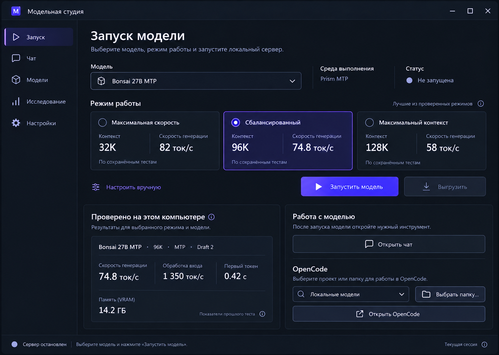
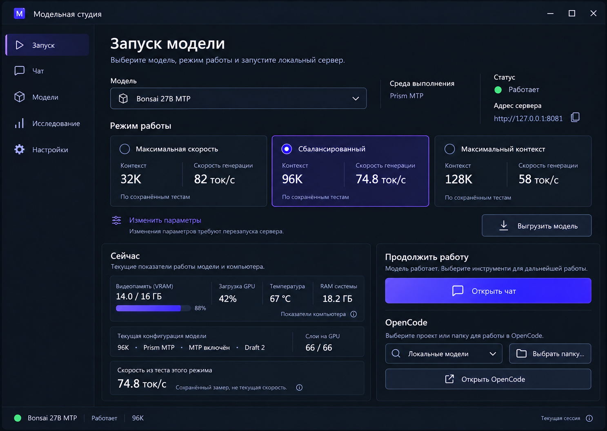
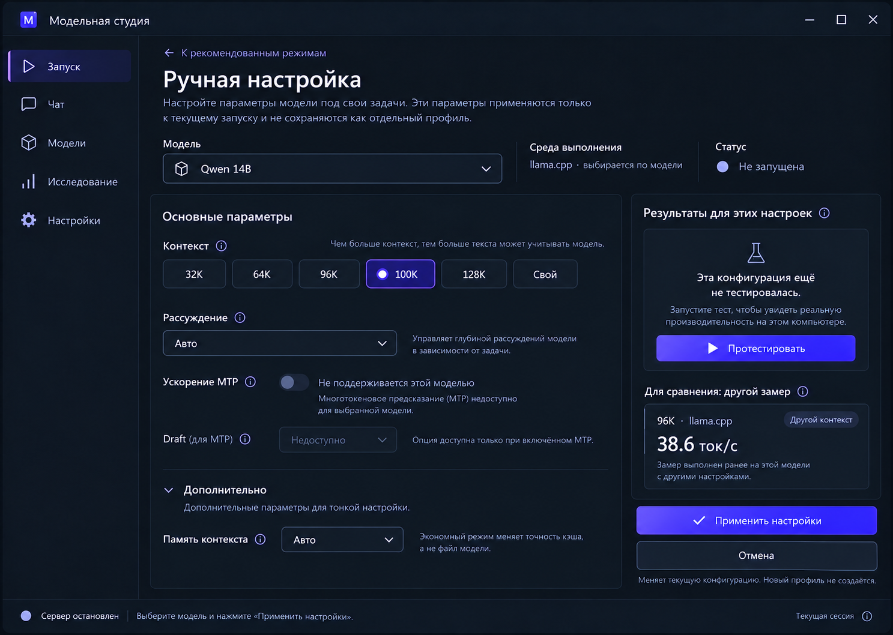
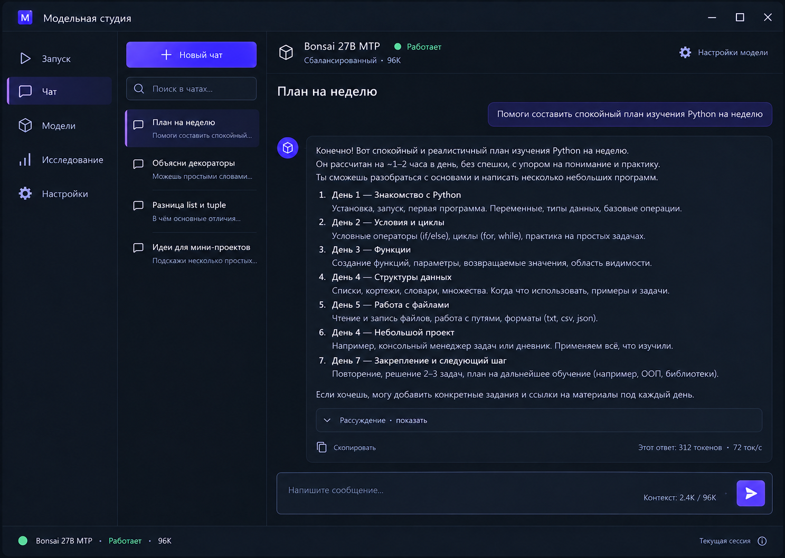
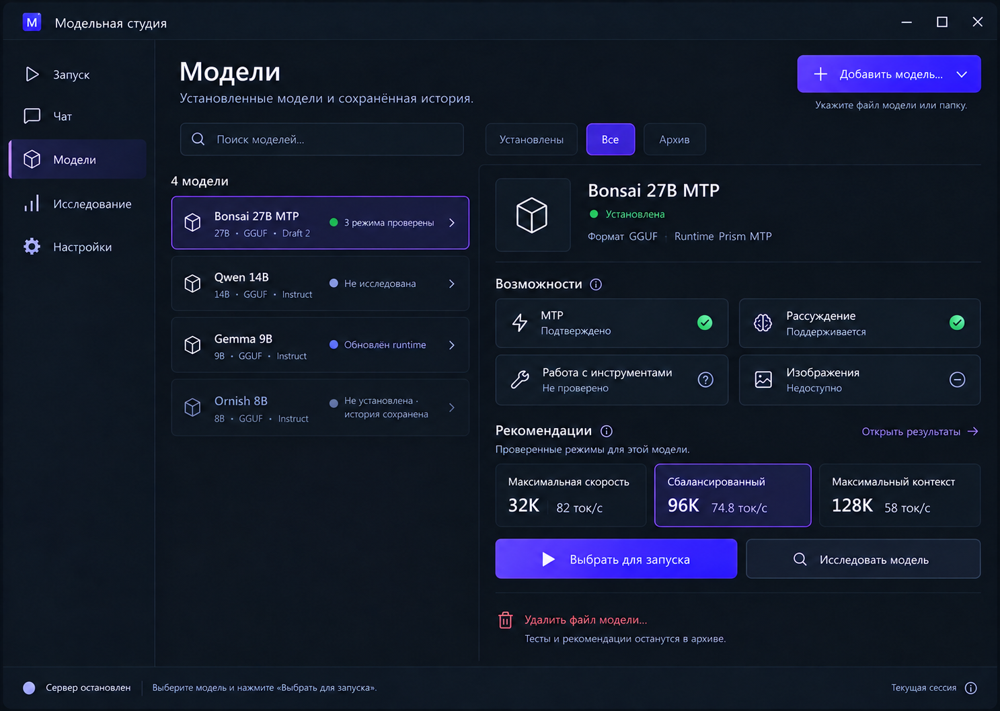
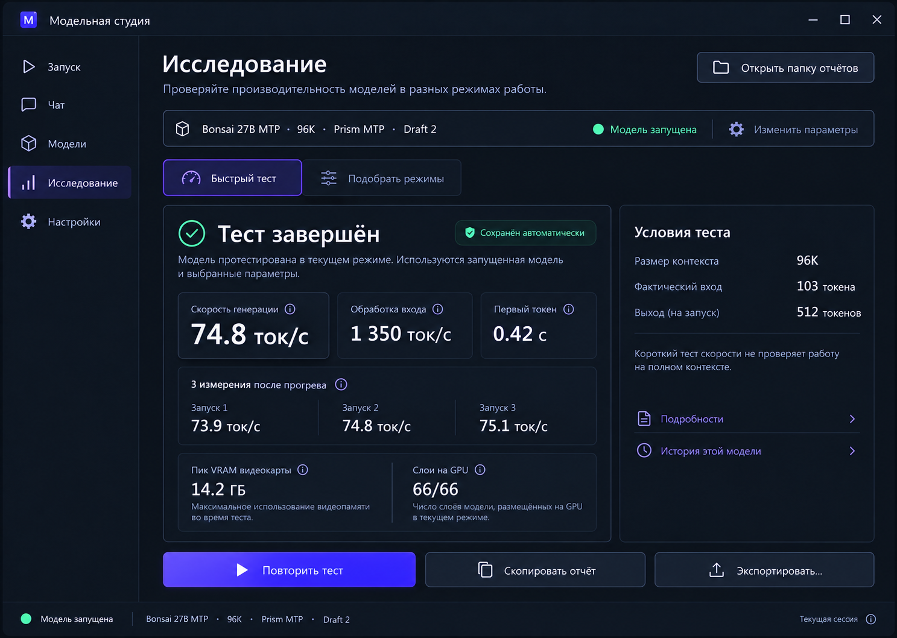
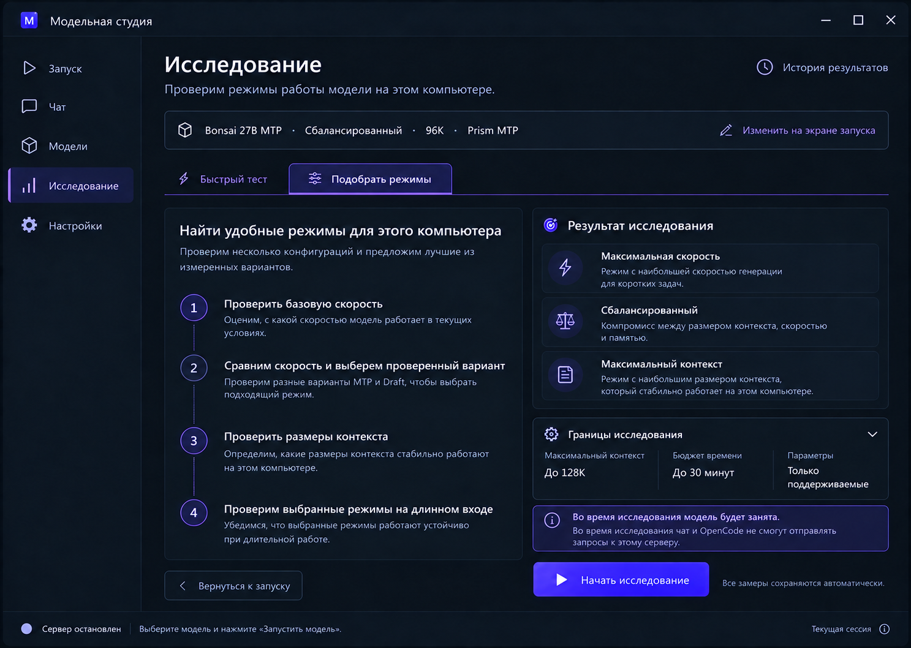
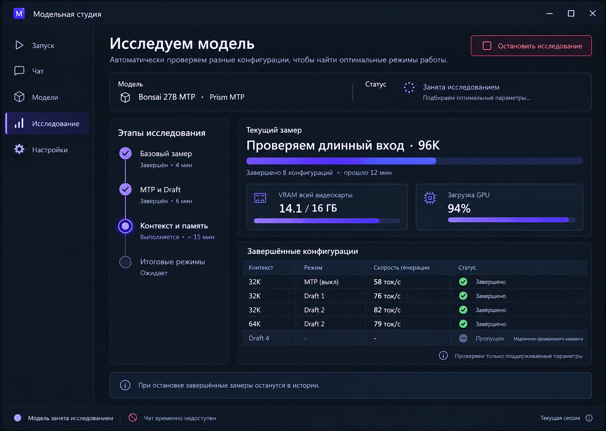
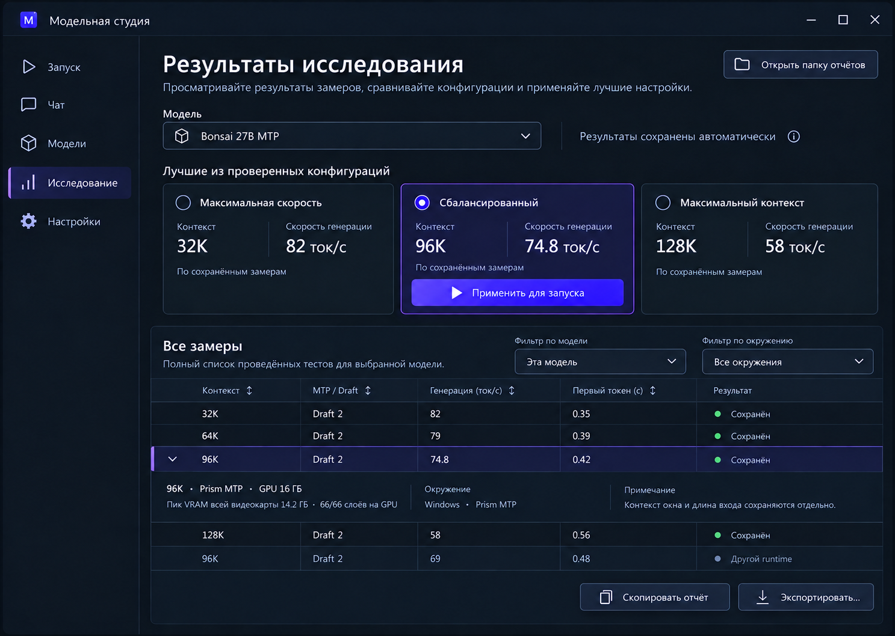
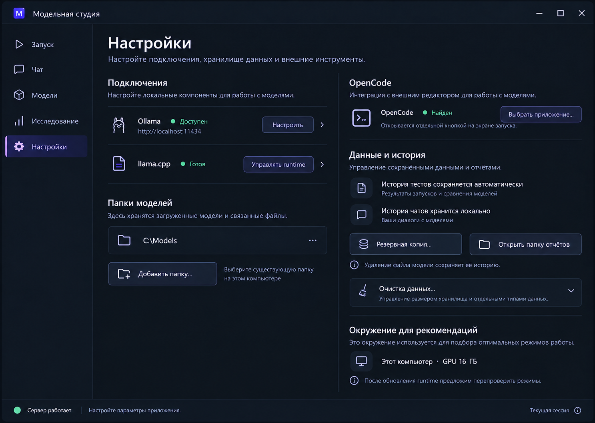

# Модельная студия — экраны v2

Полный набор из десяти макетов. [Концепция и процесс](CONCEPT.md) · [Визуальное задание](PROMPTS.md) · [Архитектура приложения](../ARCHITECTURE.md).

Сценарий: добавить модель → при желании исследовать → выбрать проверенный режим → запустить → работать в чате или OpenCode. Изменение настроек, быстрый тест и история используют общую модель, но просмотр истории не меняет запущенный сервер.

Все цифры и характеристики в изображениях — примеры для дизайна, а не новые измерения компьютера. Подписи и поведение уточняются в CONCEPT.md. Изображения созданы встроенным ImageGen на основе ранее согласованного тёмного направления.

## 1. Запуск — рекомендованные режимы

Модель и проверенный режим выбираются до запуска. Показатели прошлого теста подписаны. Чат и OpenCode открываются отдельно. Кнопка выбора папки вызывает системный диалог.

## 2. Запущенная модель — текущая сессия

Фактическая телеметрия отделена от скорости из сохранённого теста. Видны адрес сервера, действующая конфигурация и выгрузка.

## 3. Ручная настройка — нет точного замера

Настройки универсальны, недоступные возможности объясняются. Другой замер показывается только как справочный. Контекст включает 96K, 100K и своё значение.

## 4. Встроенный текстовый чат

Диалоги сохраняются локально. Разговор использует общую запущенную модель; проектная папка не обязательна. Рассуждение по умолчанию свёрнуто.

## 5. Модели — установленное и архив

Фильтры, исследованность, известные возможности и доступ к режимам. Удаление весов сохраняет историю модели.

## 6. Быстрый тест текущей конфигурации

Замер сохраняется автоматически. Условия и длина реального входа видны рядом с результатом. Можно скопировать отчёт или экспортировать его.

## 7. Подбор режимов — перед началом

Приложение объясняет этапы, ограничения по времени/контексту и влияние исследования на работающие клиенты.

## 8. Подбор режимов — выполнение

Текущий этап, завершённые конфигурации и состояние ресурсов. Остановка сохраняет завершённые замеры.

## 9. Результаты и история

Три режима — лучшие среди проверенных вариантов. История сохраняет разные конфигурации и окружения. Применение режима меняет выбор для запуска, но не запускает сервер молча.

## 10. Настройки

Подключения и runtime, каталоги моделей, OpenCode, локальное хранение и резервная копия. Управление данными отделено от удаления файлов моделей.

